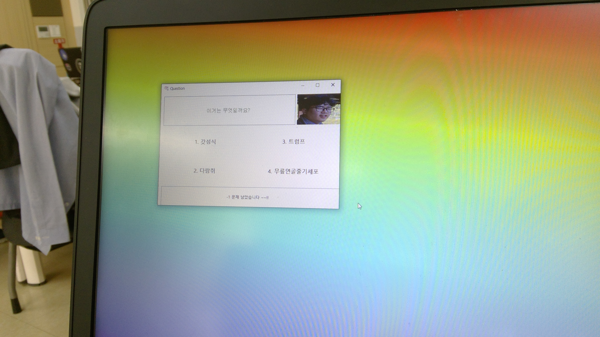

# YeongChanWare

노트북 보안을 중요시 하지 않는 학생들을 위해 만든 스크린 록커 입니다. 대충 만들었지만 PC에 악영향을 주지 않고 충분히 재밌습니다.

## Features

- 키보드 잠금
- 작업 관리자 못쓰게 함 (관리자 권한 필요)

## How-to

노트북을 잠그지 않고 외출한 친구의 노트북에 재빨리 실행시켜버려요 (관리자 권한 필요)

## Download

[Release](https://github.com/phillyai/YeongChanWare/releases/tag/2.0) 에서 다운받을 수 있습니다. 내 얼굴의 초상권따위 알 게 뭐야

## Build

`영찬.png` 파일과 `이미지 422.png`, `성식.jpg ` 파일은 직접 얼굴 사진 올리시면 됩니다.
